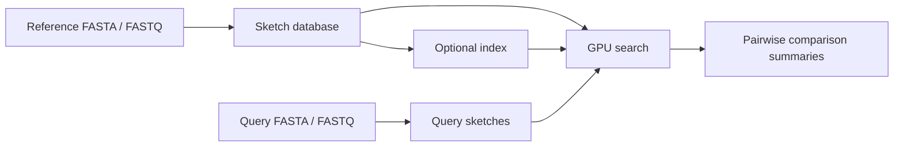

# cuDDL

[](https://tdortman.github.io/cuDDL/)

cuDDL is a C++20/CUDA library for estimating genome relationships from canonical k-mers. It builds compact sketches from FASTA and FASTQ files, compares sketches on the GPU, and searches reusable reference databases with optional dense or sparse indexes.

Use it to estimate cardinality, containment, weighted k-mer identity, and k-mer-derived ANI without retaining every distinct k-mer. These are sketch estimates, not sequence alignments.

## How it works



Each input file represents one genome, including all of its sequence records. Reference sketches can be saved once and reused across searches. The C++ API also accepts device-resident packed k-mers and raw nucleotide sequences.

## Quick start

### Requirements

- Linux and an NVIDIA GPU with a compatible driver.
- A CUDA toolkit and host compiler with C++20 support. The supplied Nix environment uses CUDA 13.3.
- nvCOMP 5, which the build links to inflate gzip genomes on the GPU.
- Meson 1.3 or newer, Ninja, and Git.

The default build targets `sm_80`, `sm_90`, and `sm_120`. Your toolkit must recognize all three targets. For a different GPU target, adjust `cuda_arch_args` in [meson.build](meson.build) before configuring.

Meson fetches the pinned dependencies, including CCCL, libdeflate, and CLI11. Use the supplied CCCL revision: cuDDL requires its CUB 3.6.0 headers rather than an arbitrary toolkit-bundled version. The initial setup needs network access.

### Build

```sh
git clone https://github.com/tdortman/cuDDL.git
cd cuDDL

# Optional: enter the supplied development environment.
nix develop

# The command-line examples are off by default, enable them explicitly.
meson setup build -Dexamples=enabled -Dtests=disabled -Dbenchmarks=disabled
meson compile -C build
```

Without Nix, install the requirements above and omit `nix develop`. The flake provides development shells for `x86_64-linux` and `aarch64-linux`.

For an existing build directory, use `meson configure build` with the same `-D` options instead of `meson setup`.

### Run a GPU smoke check

```sh
./build/examples/cuddl-main --count 4096
```

This uses synthetic packed k-mers and prints cardinality and pairwise metrics.

## Reference search

The following commands assume reference genomes are under `genomes/references/` and query genomes under `genomes/queries/`. Substitute your own paths. Database and index output paths replace existing files.

### 1. Build a reference database

```sh
./build/examples/cuddl-build-reference-db \
  --k 25 \
  --buckets 2048 \
  --output references.cuddl \
  genomes/references/
```

The builder searches the folder recursively and sorts file paths to assign reference IDs. Keep that ordered input list if you need to map result IDs back to filenames.

Supported input extensions are `.fa`, `.fna`, `.fasta`, `.ffn`, `.frn`, `.fq`, and `.fastq`, case-insensitively. Gzip and BGZF files may add `.gz`, `.bgz`, or `.bgzf`.
Files containing additional gzip member signatures use the host parser, even when the first and last member trailers match.
Fallback parsing runs between GPU batch submissions so it can overlap queued device work.
With the default `automatic` transfer, discrete GPUs inflate single-member gzip FASTA files and check each one's length and CRC32 against its trailer. Concurrent batches overlap file reads, inflation and sketch construction. Input sizes determine the split between compressed and decompressed GPU buffers within the available memory budget. Coherent-memory GPUs such as GH200 use CPU loading into pageable memory, avoiding the slower page-locked input buffers. The host loader also takes other formats and any file the GPU cannot verify. It checks member structure, DEFLATE decoding and uncompressed lengths, but skips CRC32. Check input integrity separately when that matters. Saved databases and indexes are always checksummed.

| Option            | Accepted values                                                                                                                                               |
| ----------------- | ------------------------------------------------------------------------------------------------------------------------------------------------------------- |
| `--k`             | 1 through 31                                                                                                                                                  |
| `--buckets`       | 2048, 4096, 8192, 16384, 32768, 65536, 131072                                                                                                                 |
| `--exponent-bits` | 6 (default, 10-bit mantissa) for unbounded cardinality such as metagenomes; 5 (11-bit mantissa) halves false register matches for genome-to-genome comparison |
| `--workers`       | Concurrent genome loaders, defaults to the number of logical cores. Use 1 to reduce host RAM usage.                                                           |

### 2. Search without an index

```sh
./build/examples/cuddl-reference-index search references.cuddl \
  --query genomes/queries/query-a.fna genomes/queries/query-b.fna \
  --minimum-matches 0 \
  > matches.tsv
```

`--minimum-matches 0` compares each query against every reference. The database supplies the k-mer length and sketch configuration, so queries do not take separate `--k` or `--buckets` options.

### 3. Optionally build and use an index

```sh
./build/examples/cuddl-reference-index build references.cuddl \
  --format sparse \
  --output references.cuddl.index

./build/examples/cuddl-reference-index search references.cuddl \
  --index references.cuddl.index \
  --query genomes/queries/query-a.fna genomes/queries/query-b.fna \
  --minimum-matches 1 \
  > candidates.tsv
```

Both `dense` and `sparse` index formats are supported; `dense` is the CLI default. Search detects the saved format and validates the index against the database. Rebuild the index when you rebuild the database.

`--minimum-matches` counts matching indexed buckets, not matching k-mers or a percentage identity. A positive threshold filters candidates and is not an exhaustive comparison. Omit `--index` to search directly against the database.

To compare the references with each other instead of with separate queries, replace `--query` with `--all-to-all`. Each unordered pair is searched once and reported with `query_id < reference_id`; both IDs are reference IDs. Long query lists can go in a TOML file passed as `--config options.toml` before `search`, with `query = [...]` under a `[search]` section.

### Reading the output

Search writes a tab-separated table to standard output:

```text
query_id    reference_id    lower    equal    higher    both_empty
```

The actual delimiter is a tab. Query IDs are zero-based in the order supplied to `--query`; reference IDs are zero-based in the builder's sorted file order. The remaining columns contain raw sketch comparison counts. This CLI does not output ranked hits or ANI scores. Use the C++ metric helpers when you need derived metrics.

For large result sets, pass `--output results.bin` to skip text formatting. The file holds headerless 24-byte little-endian records with the same six `uint32` fields in the same order. Python reads it with `struct.iter_unpack("<6I", data)`; NumPy reads it with a structured dtype of six `<u4` fields.

## C++ API

Include `<cuddl/cuddl.cuh>` for the main API. File-based reference database I/O is available through `<cuddl/reference_database_file.cuh>`.

| Type                                                             | Purpose                                                                        |
| ---------------------------------------------------------------- | ------------------------------------------------------------------------------ |
| `cuddl::sketch<K, BucketCount>`                                  | Own a GPU sketch, add k-mers or sequence data, and calculate pairwise metrics. |
| `cuddl::query_sketch_batch<K, BucketCount>`                      | Sketch a batch of genome files for queries.                                    |
| `cuddl::reference_database<K, BucketCount>`                      | Store reference sketches and search them on the GPU.                           |
| `cuddl::reference_index<K, BucketCount>`                         | Build optional dense or sparse search acceleration data.                       |
| `cuddl::reference_database_file` / `cuddl::reference_index_file` | Save and load databases and indexes.                                           |

Start with the runnable [sketch example](examples/main.cu), [database builder](examples/build_reference_database.cu), or [search implementation](examples/reference_index_dispatch.cu.in).

For GPU-only pipelines, `cuddl::build_sketch_store<K, BucketCount>` loads genome files into a device-resident store without downloading the registers. Each row contains `BucketCount` packed registers followed by a saturation word. The batch operations in `<cuddl/batch.cuh>` consume this layout directly. Use `query_sketch_batch` when you only need query scores.

The API uses CUDA streams. Keep the allocation stream alive longer than its sketches and keep asynchronous inputs alive and unchanged until the stream completes. `add_sequence_async` expects contiguous device-resident ASCII bases, not a FASTA file; use the file-loading APIs for FASTA and FASTQ input. Operations returning `cuddl::Result` require error handling; the examples use `CUDDL_UNWRAP`.

Pairwise helpers include `wkid`, `ani`, `containment`, and `completeness`. ANI here is the k-th root of estimated weighted k-mer identity, not alignment-derived identity.

The root Meson project exposes `cuddl_dep` for subproject integration. Examples, tests, and benchmarks default to enabled in a standalone build and disabled when cuDDL is a subproject.

## Tests

Enable the test targets in your existing build:

```sh
meson configure build -Dtests=enabled
meson compile -C build
meson test -C build --print-errorlogs
```

GPU tests require a working CUDA device. The suite covers sketch operations and persistent reference index files, alongside result serialization checks.

## Benchmarks

Benchmarks are separate from the quick-start build because they pull in NVBench and additional comparison tools.

```sh
meson configure build -Dbenchmarks=enabled
meson compile -C build
uv run scripts/run_micro_comparison.py --help
```

The [micro-comparison runner](scripts/run_micro_comparison.py) measures sketch construction, pairwise comparison, and search. It records native tool settings and separates resident processing from end-to-end timings where the tools can isolate it. Dashing2 sketch reports wall time only: its streamed FASTX readers overlap the sketch workers, so the old active-worker interval was not a resident-input timing. Dashing2 compare and search still report resident timings. The [pairwise accuracy runner](scripts/run_pairwise_accuracy.py) evaluates comparison quality; [plot_micro_comparison.py](scripts/plot_micro_comparison.py) plots micro-benchmark results.

Use the supplied development shell for the benchmark toolchain. RabbitSketch and Dashing2 builds are x86-only and are skipped on ARM hosts. Compare runs with their dataset, hardware, sketch settings, and timing scope attached, rather than treating one speedup as universal.

## License

cuDDL is distributed under the [Boost Software License 1.0](LICENSE). Third-party dependencies retain their own licenses.
